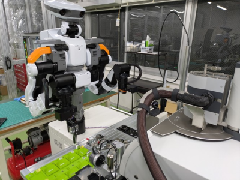
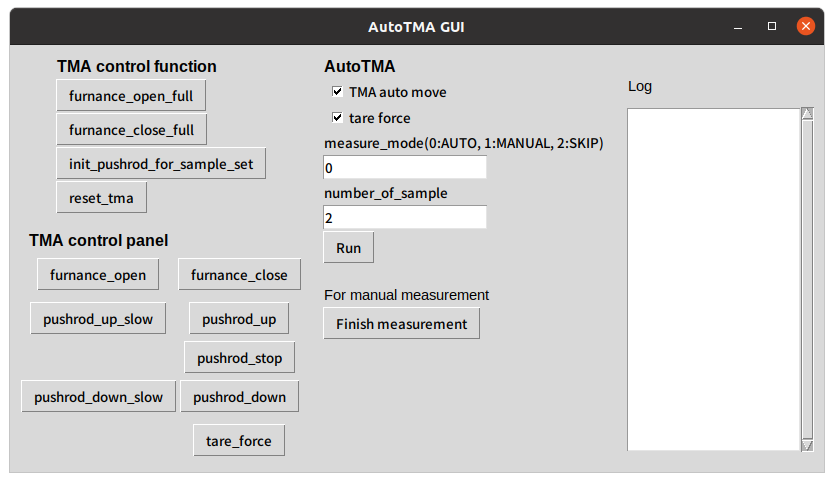

# auto_tma

## Install & Setup
- https://github.com/yuki-asano/auto_tma/wiki/Install-&-Setup


## Execution of AutoTMA process
### Preparation
**NEXTAGE**
- 本体
  - 電源を入れる (緑スイッチ)
  - リセット (青スイッチ) -> 肩LEDが緑
- NEXTAGE PC (NXproduction)
  - デスクトップ -> NxProduction v3.15 をダブルクリック 
  - (通常, 自動起動なので不要だが)
    - APIサーバーを起動 -> 黄色帯のExternal control mode activated
    - 「Servo」をクリック
- ロボット初期状態確認
  - 両手のツールを外して初期位置へ置く <- 「DIO」
  - ロボットを初期姿勢に戻す <- 「Initial Pose」
 
**TMA**
- 本体
  - 初期状態に戻す (furnanceを閉じる)
    - 操作が必要な場合は、後述の操作用GUIで操作
    ```
    furnance_open_full
    furnance_close_full
     など
    ```
  - 一回ソフトを起動してsetpointをonにして炉内温度を一定にしておく(通常25℃程度)

### Execute auto-measurement
**Launch programs**
- Manager PC (ubuntu)
  - デスクトップアプリ起動ver  
    - デスクトップショートカットのAutoTMAのアイコンをクリック    
    - もしくは, アプリ一覧から (Superボタン)「AutoTMA」を実行
      <p align="left">
       
      </p>

  - CUIから起動ver
  ```
  [terminal1]
  roscore
  
  [terminal2]
  roslaunch auto_tma auto_tma.launch  # including below
  
    # roslaunch rosbridge_server rosbridge_websocket.launch  # 他PCとroslibで通信する場合に必要
    # roslaunch mitsutoyo_instrumet mitsutoyo_micrometer.launch  # micrometer
    # rosrun netzsch_measurement netzsch_measurement_server_mock.py  # measurement server mock for manual measurement
    # rosrun auto_tma auto_tma_gui.py  # gui controller
  ```

- Measurement PC (windows)
  ```
  [terminal1] powershell
  cd \\wsl.localhost\Ubuntu\home\utokyo-user\auto_tma_ws\src\netzsch_instrument\netzsch_measurement\scripts
  python3 .\netzsch_measurement_server.py ../../auto_tma/config/auto_tma_config.yaml
  
  # 注意: ターミナルで直接 ```.\netzsch_measurement_server_thread.py```とすると,pythonが別端末で立ち上がりエラー確認できない
  ```

**GUI operation**
<p align="left">
  
</p>

- TMA control function(左上): TMA装置を操作する関数
- TMA control panel(左下): TMA装置の物理ボタンに対応
- AutoTMA(右): 自動測定の操作ボタン
  - Run: auto_tmaを開始.
  ```
  起動はCUIで、
  ./auto_tma.py      
  でも良い. 内部では
  main(tma_auto=True, tare_force=True, do_measure=True, number_of_sample=2)     
  ```
  - Finish measurement: manual測定時に、測定終了したらクリック
  


### テスト & デバッグ
- 工程全体でなく,測定だけで良ければ,ターミナルからservice callを送る. 
```
rosservice call /netzsch_measurement_server "sample_id: 0 sample_thickness: 0.0"
```
